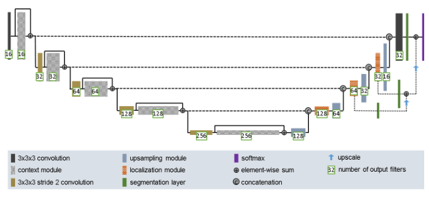

# Improved UNet for Segmenting ISIC Data set

## Description

### The Problem
The ISIC data set is a large collection of images of skin lesions. The data set also contain masks that indicate the area the lesions are located in their correponding image. The problem given is to create and train a Improved UNet model to be able to segment a skin image and show the location of a lesion. To be successfull all labels must have a minimum Dice similarity coefficient of 0.8 on the test set of the data.

### Improved UNet
The Improved UNet as the name suggests, is an advancement of the orginal UNet deep learning architecture that's used for image segmentation. A UNet can be broken into 3 main parts, the encoder, which extracts features, a bottleneck, which is used for abstract features, a decoder with skipconnections, which returns resolution whilst keeping larger details. The major difference that gives the Improved UNet its name is the inclusion of localization modules and segmentation layers. These differences can be seen in the two images below. Specifically in the right decoder part of the figures.

**UNet Architecture**

*Figure 1.1: architecture used for normal UNet from https://towardsdatascience.com/unet-line-by-line-explanation-9b191c76baf5*

**Improved UNet Architecture**

*Figure 1.1: architecture used for Improved UNet from https://arxiv.org/pdf/1802.10508v1.pdf*

